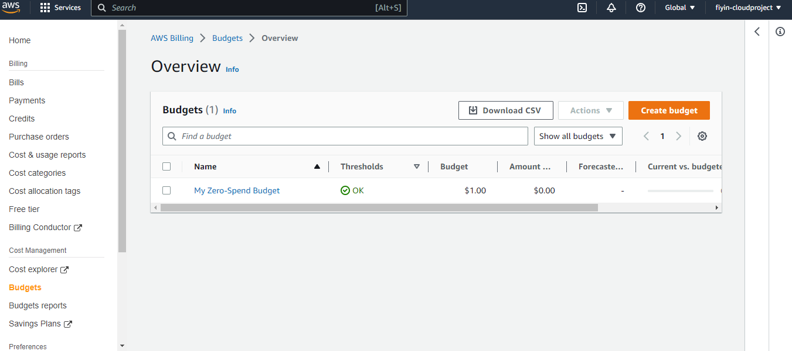

# Week 0 — Billing and Architecture

## Required Homework/Tasks

### Install and Verify AWS CLI 

I installed the AWS CLI for Windows 10 via command in **Command Prompt**:

I followed the instructions on the [AWS CLI Install Documentation Page](https://docs.aws.amazon.com/cli/latest/userguide/getting-started-install.html)

This is a view of my aws cli version and caller identity

### Create a Budget

I created my own Zero Spend Budget for $1 because I cannot afford any kind of spend.

### Create a Billing Alarm

I created my own billing alarm

### Recreate Conceptual Architectural Deisgn

I created a conceptual design for the architecture

[Lucid Charts Share Link](https://lucid.app/lucidchart/82fe731e-065f-4928-acc5-f7c87edd9f11/edit?viewport_loc=-710%2C290%2C2557%2C1152%2C0_0&invitationId=inv_01f6ae60-f884-4a1f-8441-2eeca43b88c0
)

### Recreate Logical Architectural Deisgn

[Lucid Charts Share Link](https://lucid.app/lucidchart/82fe731e-065f-4928-acc5-f7c87edd9f11/edit?viewport_loc=-397%2C-79%2C2797%2C1260%2ClPVx99pulnRO&invitationId=inv_01f6ae60-f884-4a1f-8441-2eeca43b88c0
)

