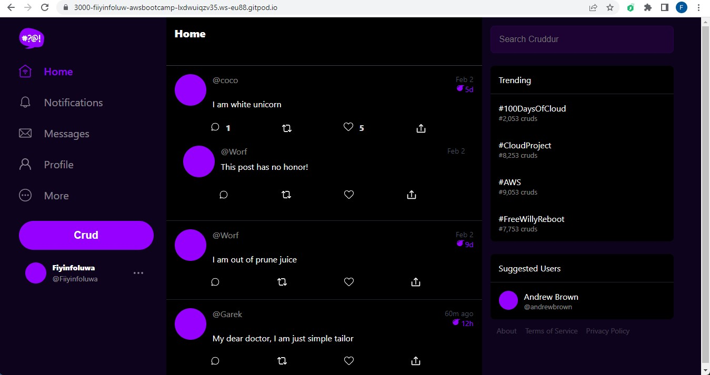
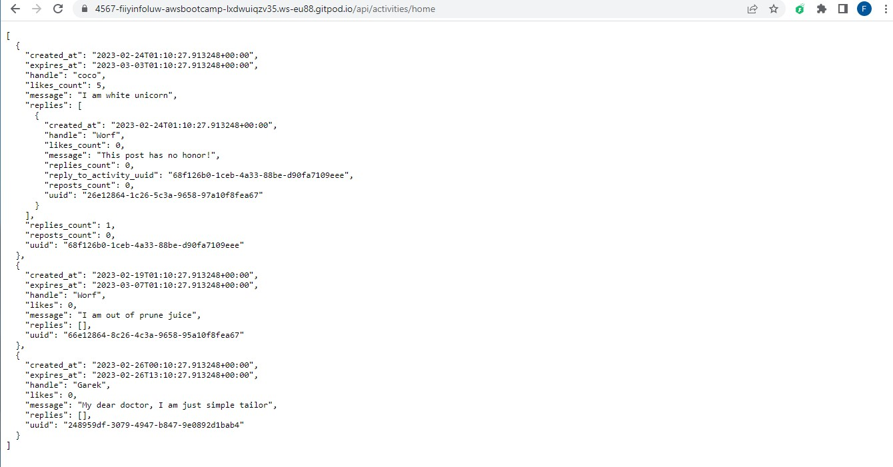
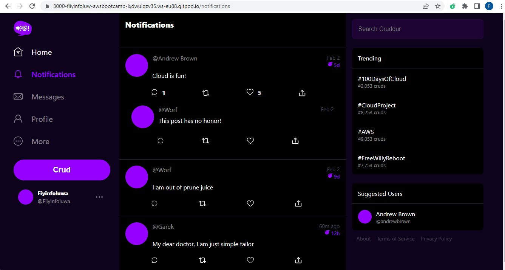
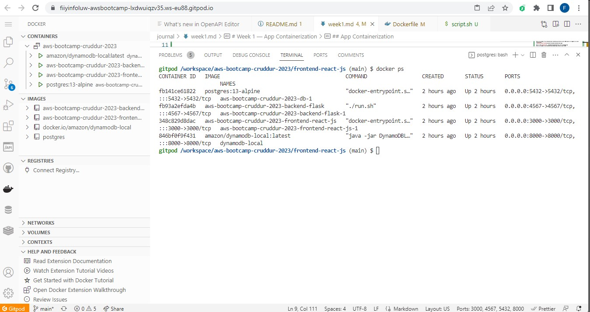

# Week 1 — App Containerization

## App Containerization

I containerized both frontend and backend apps, ensured they were working and being served on their respective ports

This is the [dockerfile](../frontend-react-js/Dockerfile) for my frontend app

This is an image of my containerized frontend app served on port 3000 while I'm logged in as user fiiyinfoluwa

This is the [dockerfile](../backend-flask/Dockerfile) for my backend app
This is an image of my containerized backend app served on port 3000

I wrote a [docker-compose file](../docker-compose.yml) to can orchestrate multiple containers to run side and side and also mount directories so we can make changes while we code.

## Notifications Feed Page

I wrote the [react page](../frontend-react-js/src/pages/NotificationsFeedPage.js) for my notifications page frontend and flask backend endpoint for the notifications page.

This is the image of of my notifications page being served while I am logged in as user fiiyinfoluwa

## CMD as a script

I wrote the CMD part of my docker file for both frontend and backend as an executable script and passed the script in both dockerfiles
This is the [script](../backend-flask/run.sh) for the CMD for the backend [dockerfile](../backend-flask/Dockerfile) and this is the [script](../frontend-react-js/script.sh) for the frontend [dockerfile](../frontend-react-js/Dockerfile)

## Dynamodb Local and Postgres as a container

I ran both dynamodb container and Postgres as a container side by side with my other containers.
This is an image of my docker containers running which includes both dynamodb and postgres

